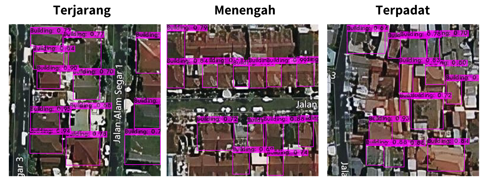

# Deteksi Bangunan Wilayah Perkotaan Menggunakan Deep Learning Berbasis Objek dengan Arsitektur YOLO pada Citra Satelit

Metode Object Detection digunakan untuk mendeteksi dan mengambil lokasi bangunan di wilayah perkotaan dari citra satelit. Model deteksi berbasis objek dibangun menggunakan arsitektur You Only Look Once (YOLO) versi ke-3 ([Redmon & Farhadi, 2018](https://arxiv.org/abs/1804.02767v1)).

## Data yang digunakan

Data yang digunakan dalam pemodelan berasal dari dua wilayah dengan sumber yang berbeda. Data untuk pemodelan pre-trained diperoleh dari SpaceNet Challenge ke-2 ([SpaceNet, 2018](https://spacenet.ai/spacenet-buildings-dataset-v2/)) pada wilayah Paris dan Khartoum. Dua kota ini dipilih dengan alasan sebagai perwakilan kota dari negara maju (Eropa) dan negara berkembang (Afrika), juga mewakilkan wilayah tropis dan subtropis sehingga ada perbedaan dari sudut datang terhadap ekuator. Adanya perbedaan karakteristik tersebut membuat variasi data semakin besar sehingga semakin banyak pembelajaran untuk melatih model deep learning. Selain itu, label bangunan untuk dataset ini juga telah tersedia pada situs SpaceNet Challenge.

Data untuk pemodelan fine-tuned diperoleh dari  [Microsoft Bing Maps Satellite Imagery](https://www.bing.com/maps). Data citra diperoleh menggunakan bantuan software `Aerial Satellite Imagery Retrieval` ([Khandhar dkk, 2020](https://github.com/chiragkhandhar/Aerial-Satellite-Imagery-Retrieval)). Software tersebut mengambil wilayah yang diinginkan dengan parameter koordinat pojok kiri atas dan pojok kanan bawah dari area penelitian, lalu memotong citra yang telah dipilih menjadi segmen-segmen secara otomatis. Kemudian anotasi label dilakukan secara manual dikarenakan belum terdapat official label bangunan di wilayah DKI Jakarta hingga penelitian mulai dilakukan. Anotasi label manual dilakukan menggunakan software `LabelImg` ([Tzutalin, 2015](https://github.com/tzutalin/labelImg)). Data citra dan label bangunan yang dikumpulkan oleh peneliti tersedia pada folder [drive](https://drive.google.com/drive/folders/1JwIrej6iTG4xwbHu_DOxpmo1ciPWWaBV) berikut.

## Lingkungan Simulasi

Pelatihan model YOLO menggunakan repositori Darknet oleh [Alexey AB](https://github.com/AlexeyAB). Eksperimen dijalankan pada Google Colaboratory versi gratis dengan GPU Nvidia Tesla K80 dan RAM hingga 12 GB. Peneliti memanfaatkan memori GPU yang disediakan oleh Google Colab dengan batas waktu tertentu. GPU dapat melakukan komputasi multipel dan simultan, sehingga dapat mempercepat proses pelatihan model. Google Colab mengalokasikan sumber daya dan memori pada waktu yang bervariasi karena mempertahankan fleksibilitas untuk menyesuaikan penggunaan perangkat keras dan batas ketersediaan dengan cepat guna mengakomodasi fluktuasi permintaan. 

## File Konfigurasi dan Kodingan

Terdapat 3 jenis file konfigurasi dalam folder `config`:

1. Format `.cfg`, berisi ukuran hyperparameter model seperti batch normalization, stride, pad, activation function pada kerangka dasar CNN, dan hyperparameter lain seperti ukuran image, ukuran batch dan subdivisions, learning rate, jumlah iterasi, dan ukuran anchors box.
2. Format `.names`, berisi nama objek yang ingin dideteksi (dalam kasus ini: bangunan)
3. Format `.data`, berisi jumlah kelas objek yang ingin dideteksi, dan relative path untuk file yang berisi path data train dan test, file names, dan folder backup untuk menyimpan weights dari model yang dijalankan. 

Selain itu, terdapat 4 file kodingan utama pada repository ini:

1. `Preprocessing Data Studi Pendukung.ipynb`, merupakan kodingan untuk melakukan preprocessing data studi pendukung Paris dan Khartoum.
2. `Preparation Data Studi Kasus.ipynb`, merupakan kodingan untuk preparation pada data studi kasus DKI Jakarta.
3. `Pemodelan Pre-trained.ipynb`, merupakan kodingan untuk melakukan pemodelan pada wilayah studi pendukung, sehingga didapatkan model pre-trained.
4. `Pemodelan Fine-tuned.ipynb`, merupakan kodingan untuk melakukan pemodelan pada wilayah studi kasus dengan memanfaatkan teknik fine-tuning dari model pre-trained yang telah didapatkan sebelumnya. Hasil yang didapatkan berupa model fine-tuned.
5. `Evaluasi Model Fine-tuned.ipynb`, merupakan kodingan untuk evaluasi model fine-tuned, serta implementasinya pada data uji.

Penjelasan alur untuk kodingan telah dijabarkan pada tiap file. Sehingga bisa dilihat langsung pada masing-masing file kodingan di atas.

Serta terdapat 2 file kodingan pendukung:
1. `generate_train.py`, merupakan kodingan untuk mengenerate relative path untuk data train 
2. `generate_test.py`, merupakan kodingan untuk mengenerate relative path untuk data test 

## Alur Pengerjaan

Tahapan pertama dimulai dengan melakukan preprocessing pada data wilayah studi pendukung Paris dan Khartoum pada file `Preprocessing Data Studi Pendukung.ipynb`. Tahap preprocessing dan preparation yang dilakukan diantaranya:

- Konversi citra dari bentuk 16-bit ke bentuk 8-bit
- Konversi label poligon bangunan ke bentuk bounding box yang sesuai dengan format YOLO
- Seleksi citra yang hanya memiliki bangunan
- Memisahkan data latih dan data uji
- Mengompresi data latih dan uji agar memudahkan saat melakukan pemodelan pada Google Colab
- Mencari hyperparameter anchors box berdasarkan sebaran pada data yang ada

Setelah itu dilakukan pemodelan pada `Pemodelan Pre-trained.ipynb`. Sebelum melakukan melakukan training data, terdapat 3 file konfigurasi yang harus dipersiapkan, seperti yang telah dijelaskan sebelumnya. File konfigurasi  untuk pemodelan pre-trained tersedia dalam folder `config/pre-trained`. Kemudian dilakukan training, sehingga diperoleh model pre-trained. Pre-trained weights yang didapatkan tersedia pada [link](https://drive.google.com/drive/folders/1BdvCFUyNS-kz_0X6-jG_rQ-4qoxmZ-N0) berikut. 

Selanjutnya, untuk melakukan fine-tuning pada data studi kasus, dilakukan preparation data terlebih dahulu pada file `Preparation Data Studi Kasus.ipynb`. Perbedaan dengan sebelumnya, pemodelan fine-tuned ini menggunakan Cross Validation (CV) sebagai metode validasi model. Metode 5-fold CV membuat sebanyak 5 pembagian (fold) kemudian melakukan validasi untuk semua kombinasi dari pembagian tersebut. Misalnya, untuk proses
pelatihan pertama, data uji menggunakan fold 1 sedangkan fold sisanya merupakan data latih, untuk proses pelatihan kedua, data uji bergeser menggunakan fold 2 sedangkan fold sisa merupakan data latih, dan seterusnya hingga proses pelatihan kelima. Hal ini digunakan untuk meminimalkan sampling bias pada sampel data uji yang diambil acak karena keterbatasan data keseluruhan yang hanya berjumlah 312 segmen gambar, sehingga ditakutkan terjadi kesalahan saat menilai performa model karena bias dari pengambilan sampel uji.

Tahapan preparation yang dilakukan ialah:

- Memisahkan data latih dan data uji menggunakan `StratifiedFold` dari library `Sklearn`
- Mengompresi data yang sudah dipisahkan
- Melihat sebaran data ukuran bangunan
- Mencari hyperparameter anchors box berdasarkan sebaran pada data yang ada

Setelah itu dilakukan pemodelan pada `Pemodelan Fine-tuned.ipynb`. Seperti pada pemodelan pre-trained, pemodelan fine-tuned juga disiapkan 3 jenis file konfigurasi yang tersedia pada folder `config/fine-tuned`. Namun dikarenakan menggunakan CV sebanyak 5 fold, sehingga dibutuhkan 3 x 5 = 15 file konfigurasi dengan nama file yang berbeda. Lalu dilakukan training, dan dihasilkan 15 weights fine-tuned. Salah satu weights tersedia pada [link](https://drive.google.com/drive/folders/1nEpHtWk0EILPlmOjNDycVLSt5kIHTNG-?usp=sharing) berikut.

Kemudian model fine-tuned yang diperoleh dievaluasi pada file `Evaluation Model Fine-tuned.ipynb`. Evaluasi dilihat dari 2 sudut pandang, yakni evaluasi model secara umum yang dilihat menggunakan seluruh wilayah, dan evaluasi model pada tiap wilayah. Hasil implementasi pada data uji dapat dilihat sebagai berikut. 

